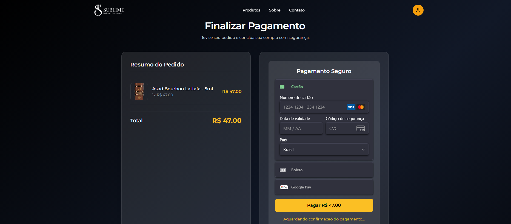

# 💎 E-commerce – Sublime Perfumes

## 🌐 Demonstração ao Vivo

🛒 **Acesse o projeto:** [sublimeperfumes.com.br](https://sublimeperfumes.com.br)

📱 Site 100% responsivo, desenvolvido pela [Digital Tricks](https://digitaltricks.com.br)  
💳 Integração completa com **Stripe** e painel administrativo em tempo real.

---

## 💼 Resumo do Projeto

O **E-commerce Sublime Perfumes** foi desenvolvido para oferecer uma experiência de compra moderna e fluida para uma marca de perfumes importados.  
O projeto inclui catálogo dinâmico, carrinho de compras, checkout com integração de pagamentos e um painel administrativo para controle de estoque e pedidos.

**Principais objetivos:**
- Criar uma plataforma elegante e intuitiva para aumentar as vendas online  
- Automatizar o processo de pedidos e pagamentos  
- Fornecer painel administrativo para o gestor acompanhar métricas e produtos  

**Resultado:**  
Um site completo, responsivo e otimizado, preparado para campanhas de marketing digital e SEO.

---

## 🖼️ Prévia do Projeto

| Home | Catálogo | Checkout | Painel Admin |
|------|-----------|-----------|--------------|
|  |  |  |  |

> *As imagens acima são demonstrativas do fluxo real de navegação e gerenciamento da loja.*

---

## ⚙️ Destaques Técnicos

- 🔐 Autenticação e autorização com **JWT**
- 🧩 API RESTful desenvolvida com **Spring Boot**
- 💳 Integração completa com **Stripe** (pagamentos reais)
- 🗄️ Banco **PostgreSQL** com **JPA/Hibernate**
- ⚙️ Containerização com **Docker Compose**
- 🖥️ Frontend moderno com **ReactJS + Tailwind CSS**
- 🚀 Deploy otimizado em servidor **Linux (NGINX + SSL)**
- 📦 Estrutura escalável para novos módulos (ex.: blog, automação de marketing)

---

Projeto completo de **E-commerce** utilizando **Spring Boot** no backend e **ReactJS** no frontend.  
Sistema com painel administrativo, gerenciamento de usuários, catálogo de produtos e integração com **Stripe** para pagamentos online.

---

## 🛠 Tecnologias

---

## 🌟 Funcionalidades

- Cadastro, login e gerenciamento de usuários  
- Painel administrativo completo  
- Catálogo dinâmico de perfumes importados  
- Carrinho de compras com atualização em tempo real  
- Processamento de pedidos e pagamentos via **Stripe**  
- Cálculo automático de frete  
- Integração com **PostgreSQL**  
- Interface moderna e responsiva (**React + Tailwind**)  

---

## 🚀 Instalação e Execução

### 🔧 Pré-requisitos

- Java 17+ e Gradle  
- Node.js 16+ e npm/yarn  
- PostgreSQL  
- (Opcional) Docker e Docker Compose

### 🌍 Variáveis de ambiente

Crie um arquivo `.env` na raiz:

env
# Stripe
STRIPE_SECRET_KEY=sk_test_XXXXXX

# Spring / Banco
SPRING_DATASOURCE_URL=jdbc:postgresql://localhost:5432/ecommerce
SPRING_DATASOURCE_USERNAME=postgres
SPRING_DATASOURCE_PASSWORD=senha

# Segurança
JWT_SECRET=umSegredoMuitoSeguro

🖥️ Backend (Spring Boot)
cd backend
mvn clean package
mvn spring-boot:run

O backend estará em http://localhost:8080.

💻 Frontend (React)
cd frontend
npm install
npm run dev

O frontend abrirá em http://localhost:3000.

Para gerar build de produção:

npm run build

🧠 Aprendizados e Desafios

Durante o desenvolvimento, enfrentei desafios de integração entre frontend e backend, especialmente:

Configuração de CORS e autenticação JWT

Sincronização de estados entre React e API REST

Implementação segura de pagamentos via Stripe

Deploy com NGINX + SSL e otimização de performance

Essas etapas fortaleceram minha experiência com sistemas full stack e deploy em ambiente de produção.

🔐 Observações

⚠️ Não exponha a STRIPE_SECRET_KEY em repositórios públicos

Verifique configurações de application.yml / application.properties

Ajuste CORS para o domínio em produção (https://sublimeperfumes.com.br)

🤝 Créditos

Desenvolvido por Digital Tricks

Projeto real: sublimeperfumes.com.br

📄 Licença

Este projeto foi desenvolvido para fins comerciais e demonstração.
Reprodução ou redistribuição sem autorização é proibida.

📬 Contato

📧 contato@digitaltricks.com.br

🌐 digitaltricks.com.br

📱 (85) 92174-3200
